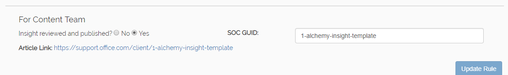

# Potrebne alhemija zaglavlje H1, H2, ne radim.Required Alchemy Header H1, H2's dont work.
Najbolje prakse i uputstva za kreiranje alhemija:Best Practices and guidelines for Alchemy authoring:

1. **Ne Gnezde se alhemija uvida u fasciklama**- ovo će slomiti url strukturu. Proveravamo drugog izlaza.**Do not nest Alchemy Insights in folders**- this will break the url structure. We're looking into fixing this.
1. Datoteke u fascikli " **AlchemyInsights** " bi trebalo pravilo ID i ime pravila iz [alhemije partnerski portal](https://alchemyportal.azurewebsites.net) u ime datoteke.Files in the **AlchemyInsights** folder should have Rule ID and Rule Name from the [Alchemy Partner portal](https://alchemyportal.azurewebsites.net) in the filename.
    1. npr. ***976-How-to-enable-litigation-hold***ex. ***976-How-to-enable-litigation-hold***
1. Koristite metapodatke na vrhu ovu datoteku kao predložak. Nije bio potreban.Use the metadata at the top of this file as your template. Nothing else is required.
1. U [alhemija partnerski portal](https://alchemyportal.azurewebsites.net), dođite do odeljka **kupca uvid naslov:** i koristi to kao početak postavite H1 naslova za uvid.In the [Alchemy Partner portal](https://alchemyportal.azurewebsites.net), navigate down to the section **Customer Insight Title:** and use that as a starting point for your H1 title for the insight. 
    > [!NOTE]
    > Alhemija uvid mora da ima samo za jednu H1 na vrhu ili Razbit će se u proizvodnji. H2s ne donosi toliko koristi **podebljano** ili drugim konvencijama koje će označavati odvojene sekcije.Alchemy Insights MUST have only a single H1 at the top or they will break in production. H2s dont render either so use **bold** or other conventions to signify separate sections.
1. Zatim popunite telo teksta koristeći nacrt materijal u odeljku kupca opažanja alhemija pravilo straniceNext, fill in the body text using the draft material in the Customer Insights section of the Alchemy Rule page
    1. Znakovima za nabrajanje su u reduBulleted lists are fine
    1. I numerisane listeNumbered lists too
    1. **Podebljano** i *kurzivno* su tudu**Bold** and *italic* are a-ok
    1. Veze treba da bude ni **„veze ka web” / eksterni** OR **duboko-veze ka elemente korisničkog Interfejsa**, ne interne veze.Links should always be either **"links to web"/external** OR **deep-links to UI elements**, not internal links.

I ovo je stvarno već malo predugo. Najbolji metod je oko 400 znakova---And this is really already a bit too long. Best practice is about 400 characters ---------------------------------

Kada sadržaj bude spreman, povuci za uživo granu. Onda, idi do [alhemija partnerski portal](https://alchemyportal.azurewebsites.net) i unesite ime datoteke u polje URL adresa. Uverite se da uvid pregledali i objavili kaže „da”, a zatim izaberite stavku ažuriranje pravilo. **(Ovo će izgledaju lepse u novu verziju portal - otpuštajući uskoro).** 
 Once your content is ready, pull it to the live branch. Then, go to the [Alchemy Partner portal](https://alchemyportal.azurewebsites.net) and enter the filename into the url field. Make sure Insight reviewed and published says "yes" and then click Update Rule. **(This will look prettier in the new version of the portal - releasing soon.)**

