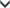

# Primanju e-maila blokiranih pošiljalaca

Ako e-poštu od blokiranih pošiljaoca i dalje pojavljuje u prijemnom poštanskom sandučetu, pošiljalac mogao da se krije svoje prave e-adresu.
  
Da biste proverili pošiljaoca pravi email adresu:
  
1. Izaberite  na vrhu prozora poruke i izaberite **Prikaz izvor poruke**.
    
2. Z.f.t. **izvor poruke** dok ne pronađete polje **iz** . 
    
3. Istaknite adresu e-pošte koji se nalazi unutar \< \> i desnim tasterom miša kliknite na **Kopiraj**
    
4. Koristite ovaj pravi e-adresu da biste blokirali pošiljaoca. Иitam kako da [blokirate pošiljalaca ili deblokirate pošiljalaca u Outlook.com](https://support.office.com/article/afba1c94-77bb-4f50-8b85-057cf52f4d5e.aspx).
    
Za više informacija pročitajte šta treba uraditi ako si [primanju e-maila blokiranih pošiljalaca](https://go.microsoft.com/fwlink/p/?linkid=2002011&amp;clcid=0x409).
  

