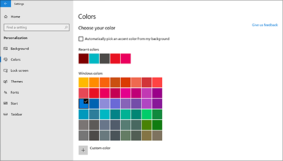
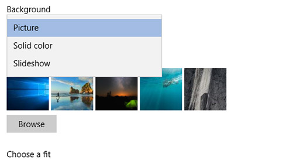

# Promena pozadine radne površine i boja

Da biste promenili postavke boja, idite na **početne** > **Postavke** > **** > **boja**za personalizaciju, a zatim odaberite sopstvenu boju ili pustite da Windows povuče boju za naglašavanje iz pozadine.

Da biste**promenili pozadinu radne** > površine, idite u**pozadinu**" **Start** > "**Postavke** > , a zatim odaberite sliku, punu boju ili kreirajte projekcija slajdova sa slikama. 

Želite li još pozadina radne površine i boje? Posetite [Microsoft prodavnicu](https://www.microsoft.com/store/collections/windowsthemes) da biste odabrali više desetina besplatnih tema.
