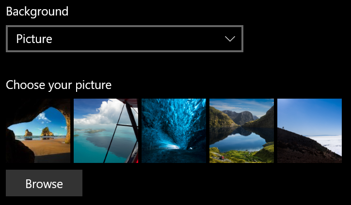
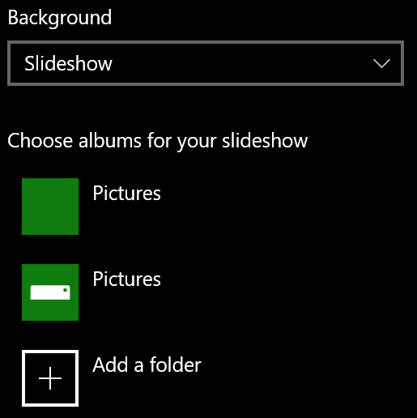

# Promena pozadine ekrana na zaključanom ekranu

- Idite na **Postavke** > za **zaključavanje ekrana**za**personalizaciju** >. Ili kliknite ili dodirnite [ovde](ms-settings:lockscreen?activationSource=GetHelp).

- Da biste postavili prilagođenu sliku za pozadinu, izaberite **sliku** sa padajuće liste za **pozadinu** , a zatim odaberite ili **potražite** sliku.

  

- Da biste podesili projekcija slajdova sa prilagođenim slikama, izaberite " **Projekcija slajdova** " sa padajuće liste za **pozadinu** i odaberite album ili dodajte fasciklu koja sadrži slike za prikaz slajdova.

  
