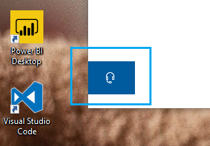

# Kontaktirajte nas tako što ćete kliknuti na dugme slušalicaContact us by clicking the headphone button

Ako želite da se obratite Microsoft podršci, kliknite na dugme " **kontaktirajte nas** " u donjem levom uglu ove aplikacije.If you'd like to contact Microsoft Support, please click **Contact us** in the lower left corner of this app. Unutar prozora "poletanje", bićete vođeni na odgovarajući kanal za podršku nakon što izaberete kategoriju proizvoda i izdaje.Inside the fly-out window, you will be guided to the right support channel after choosing your product and issue category.

Možete da nastavite sa korišćenjem interakcije sa ostatkom aplikacije čak i nakon što ste pokrenuli sesiju američkog kontakta.You can keep interacting with the rest of the app even after you have initiated a Contact us session. Tabla "kontakt sad" može biti privremeno umanjen tako što ćete kliknuti na bilo koje mesto unutar aplikacije.The Contact us panel can be temporarily minimized by clicking anywhere else inside the app. Da biste se vratili na istu sesiju, samo kliknite na **nas** ponovo.To return to the same session, just click **Contact us** again.
