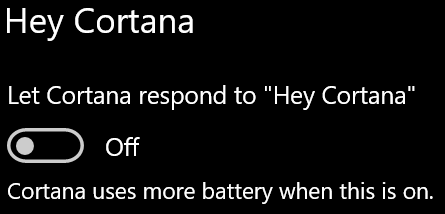

# Cortana ne priča samnom ili me ne čujeCortana doesn’t talk to me or can’t hear me

Ako pokušavate da koristite funkciju "Hey Cortana" koja vam omogućava da razgovarate sa Cortana bez biranja dugmeta "Cortana" na traci zadataka ili na dugmetu "mikrofon" u okviru aplikacije Cortana, potvrdite da je funkcija omogućena:If you are trying to use the "Hey Cortana" feature, which allows you to talk to Cortana without selecting the Cortana button on the taskbar or the microphone button in the Cortana panel, confirm that the feature is enabled:

1. Idite na **početni ekran**, a zatim izaberite **[Postavke > Cortana](ms-settings:cortana?activationSource=GetHelp)**.Go to **Start**, then select **[Settings > Cortana](ms-settings:cortana?activationSource=GetHelp)**.
2. U okviru " **Hey Cortana**", prebacite na **"Pusti Cortana" da reaguje na "Zdravo** **da**".Under **Hey Cortana**, switch the **Let Cortana respond to "Hey Cortana"** toggle to **On**.

**Da li vaše postavke privatnosti sprečavaju da vas Cortana čuje?****Are your privacy settings preventing Cortana from hearing you?**

Vaše postavke privatnosti mogu da spreče Cortana da reaguje na vaš glas.Your privacy settings can prevent Cortana from responding to your voice.
- Proverite da li je uključeno prepoznavanje govora na mreži:Check to make sure Online Speech recognition is turned on:
    - Idite na **početni ekran**, a zatim izaberite stavku **[postavke > privatnost > govor](ms-settings:privacy-speech?activationSource=GetHelp)**.Go to **Start**, then click **[Settings > Privacy > Speech](ms-settings:privacy-speech?activationSource=GetHelp)**.
    - U okviru stavke " **Prepoznavanje govora na mreži**" prebacite postavku na **Uključeno**.Under **Online speech recognition**, switch the setting to **On**.
- Proverite da li Cortana ima dozvolu za pristup vašem mikrofonu.Check to make sure Cortana has permission to access your microphone. 
    - Idite na početni ekran, a zatim izaberite stavku **[postavke > privatnost > mikrofon](ms-settings:privacy-microphone?activationSource=GetHelp)**.Go to Start, then click **[Settings > Privacy > Microphone](ms-settings:privacy-microphone?activationSource=GetHelp)**.
    - U okviru **Odaberite aplikacije koje mogu da pristupe vašem mikrofonu**, potražite **Cortana** u okviru liste aplikacija i usluga i uverite se da je komutator **uključen**.Under **Choose which apps can access your microphone**, look for **Cortana** within the list of apps and services and make sure the switch is toggled to **On**.

Osim toga, uverite se i da su zvučnici ili mikrofoni spremni da rade da bi pričali sa Cortana.Moreover, please also make sure that your speakers or microphones are up and working in order to talk to Cortana.
