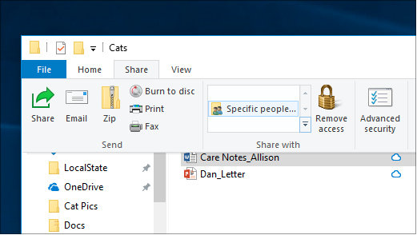
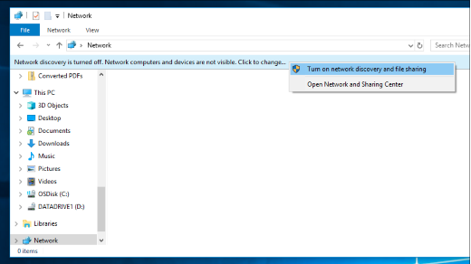

# Deljenje datoteka putem mreže u operativnom sistemu Windows 10

**Napomena**: Ako ste ranije koristili funkciju HomeGroup za deljenje datoteka, obratite pažnju na to da je matična grupa uklonjena iz operativnog sistema Windows 10 (verzija 1803). Sada možete da delite štampače i datoteke koristeći ugrađene funkcije u operativnom sistemu Windows 10.

**Deljenje datoteka ili fascikli preko mreže**

- U **istraživaču datoteka**izaberite datoteku > u gornjem > u odeljku " **Deljenje sa** " izaberite karticu " **Deljenje** sa", izaberite stavku " **određene osobe**".

    
          
- Ako istovremeno izaberete više datoteka, možete da ih delite na isti način. Takođe radi i za fascikle.

**Da biste videli uređaje na mreži koji dele datoteke**

- Idite na **mrežu**u **istraživaču datoteka**. Ako otkrivanje mreže nije omogućeno, videćete poruku o grešci "otkrivanje mreže je isključeno..."

- Kliknite na **otkrivanje mreže je isključeno** reklamni natpis, a zatim izaberite stavku **Uključi otkrivanje mreže i deljenje datoteka**.

    

[Pročitajte više o deljenju datoteka preko mreže](https://support.microsoft.com/help/4092694/windows-10-file-sharing-over-a-network)

[Deljenje datoteka pomoću aplikacija, OneDrive, e-poruka i drugih](https://support.microsoft.com/help/4027674/windows-10-share-files-in-file-explorer)
