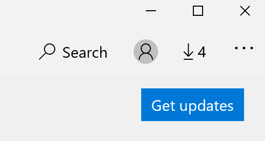

# Rešavanje jezika prikaza aplikacijaFix the display language of apps

Kada promenite jezik prikaza u operativnom sistemu Windows 10, neke aplikacije će možda i dalje koristiti prethodni jezik kada ih otvorite.After you change the display language in Windows 10, some apps may still use the previous language when you open them. Do ovoga dolazi zato što nove verzije aplikacija za taj jezik moraju biti preuzete iz prodavnice.This happens because new versions of the apps for that language must be downloaded from the Store. Da biste otklonili ovaj problem, možete ili sačekati automatsku ispravku ili možete ručno instalirati ažuriranu verziju aplikacija.To fix this problem, you can either wait for the automatic update, or you can manually install the updated version of the apps.

Da biste ručno instalirali ispravku, otvorite **Microsoft prodavnicu** i kliknite na dugme " **preuzimanja i dopune** " u gornjem desnom uglu.To manually install the update, open **Microsoft Store** and click **Downloads and updates** in the top right corner. Zatim kliknite na dugme **Preuzmi ažurirane verzije**.Then click **Get updates**. Ako se jezik ne menja nakon dovršavanja ažuriranja, pokušajte da ponovo pokrenete računar.If the language is not changed after the update is complete, try restarting your PC.

Da biste pročitali više o jezičkim postavkama za unos i prikaz, pogledajte odeljak [Upravljanje jezičkim postavkama za unos i prikaz u operativnom sistemu Windows 10](https://support.microsoft.com/help/4027670/windows-10-add-and-switch-input-and-display-language-preferences).To read more about input and display language settings, see [Manage your input and display language settings in Windows 10](https://support.microsoft.com/help/4027670/windows-10-add-and-switch-input-and-display-language-preferences).
