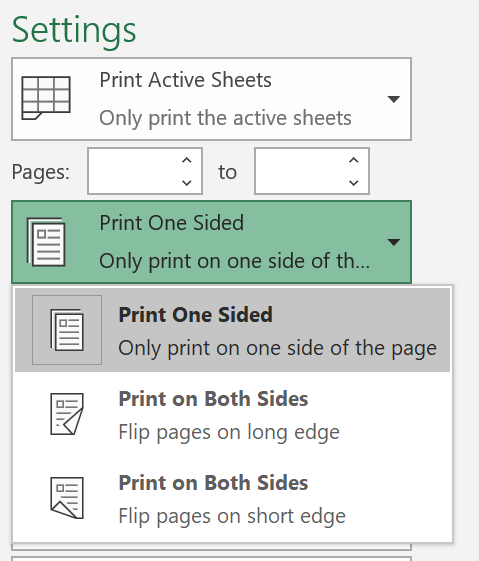
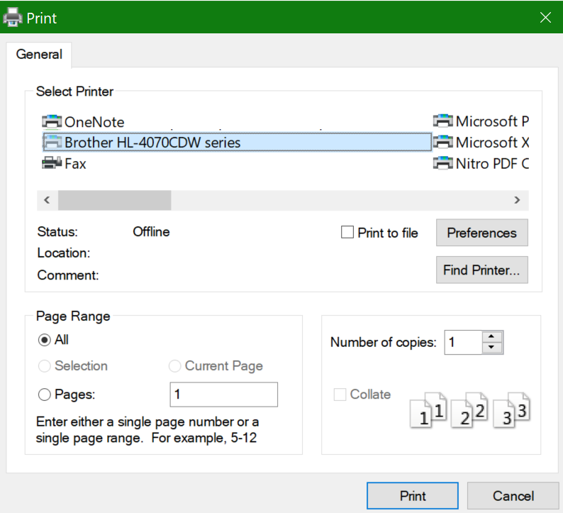

# Štampanje na obe strane papira (obostrano štampanje)Printing on both sides of paper (duplex printing)

**Da li je moj štampač sposoban za obostrano štampanje?****Is my printer capable of duplex printing?**

Rezime funkcije štampača ili priručnik treba da vam kaže da li je sposoban da štampa sa obe strane papira, takođe poznat kao "obostrano štampanje".Your printer’s feature summary or manual should tell you whether it is capable of printing on both sides of the paper, also known as “duplex printing.” Ako imate Microsoft Office, drugi način da saznate jeste da otvorite Office aplikaciju kao što je Word ili Excel, tako što ćete se postarati za **> štampanje**, uverite se da je izabran pravi štampač i potražiti mogućnost u odeljku "Postavke".If you have Microsoft Office, another way to find out is by opening an Office app like Word or Excel, going to **File > Print**, making sure the right printer is selected, and looking for the capability in the Settings section. Na primer:For example: 

**Obostrano štampanje u programu Microsoft Office****Duplex printing in Microsoft Office**

Ako vaš štampač može da štampa sa obe strane, kada odete u **datoteku > odštampati** u aplikaciji Office, videćete opciju "Štampaj sa obe strane", kao što je prikazano u gornjem primeru.If your printer is capable of printing on both sides, when you go to **File > Print** in the Office app, you will see an option to “Print on Both Sides,” as shown in the example above.  Izaberite tip obostranog štampanja koji želite (okretanje na duge ivice ili okretanje na kratke ivice), a zatim kliknite na dugme **Odštampaj** da biste pokrenuli odštampani otisak.Select the type of duplex printing you want (flip on long edge, or flip on short edge), and click **Print** to start the printout.

**Obostrano štampanje iz bilo koje aplikacije****Duplex printing from any application**

U mnogim aplikacijama prilikom štampanja videćete opšti dijalog za štampanje koji izgleda ovako:In many apps when you print you will see a general print dialog that looks like this: 

Uverite se da je izabran pravi štampač, a zatim kliknite na dugme " **željene postavke** " da biste otvorili prozor željene postavke štampača.Make sure the right printer is selected, then click **Preferences** to open the printer preferences window. Ako je štampač sposoban za obostrano štampanje, mogućnost omogućavanja ovog zadatka za štampanje će se prikazati u tom prozoru.If the printer is capable of duplex printing, the ability to enable this for the current print job will show in that window.
