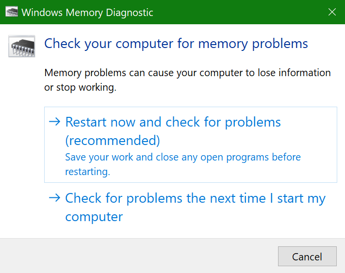
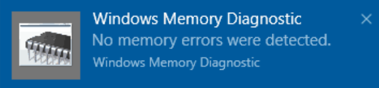

# Pokretanje Windows dijagnostike memorije u operativnom sistemu Windows 10Run Windows Memory Diagnostics in Windows 10

Ako se prozori i aplikacije na RAČUNARU pojave, zamrzavaju ili deluju na nestabilan način, možda imate problem sa memorijom računara (RAM).If Windows and apps on your PC are crashing, freezing, or acting in an unstable manner, you may have a problem with the PC’s memory (RAM). Windows dijagnostika memorije možete pokrenuti da biste proverili da li ima problema sa RAM-om računara.You can run the Windows Memory Diagnostic to check for problems with the PC’s RAM.

U polju za pretragu na traci zadataka otkucajte **dijagnostiku memorije**, a zatim izaberite **Windows dijagnostika memorije**.In the search box on your taskbar, type **memory diagnostic**, and then select **Windows Memory Diagnostic**. 

Da biste pokrenuli dijagnostiku, potrebno je ponovo pokrenuti računar.To run the diagnostic, the PC needs to restart. Imate opciju da odmah ponovo pokrenete računar (Sačuvajte svoj rad i zatvorite otvorene dokumente i e-poruke) ili planirajte da se dijagnostika automatski pokreće sledeći put kada se računar ponovo pokrene:You have the option to restart immediately (please save your work and close open documents and e-mails first), or schedule the diagnostic to run automatically the next time the PC restarts:

Kada se računar ponovo pokrene, **Windows alatka za dijagnostiku memorije** će se automatski pokrenuti.When the PC restarts, the **Windows Memory Diagnostics Tool** will run automatically. Status i napredak će biti prikazani u toku dijagnostike, a vi imate opciju otkazivanja dijagnostike tako što ćete na tastaturi udarati taster **Esc** .Status and progress will be displayed as the diagnostics run, and you have the option of cancelling the diagnostics by hitting the **ESC** key on your keyboard.

Kada se dijagnostika dovrši, Windows će se normalno pokrenuti.When the diagnostics are complete, Windows will start normally.
Odmah nakon ponovnog pokretanja, kada se pojavi radna površina, pojaviće se obaveštenje (pored ikone **centra aktivnosti** na traci zadataka) da biste označili da li su pronađene greške u memoriji.Immediately after restart, when the Desktop appears, a notification will appear (next to the **Action Center** icon on the taskbar), to indicate whether any memory errors were found. Na primer:For example:

Evo ikone Centra aktivnosti:Here's the Action Center icon:  

I uzorak obaveštenja:And a sample notification: 

Ako ste propustili obaveštenje, možete da izaberete ikonu **centra aktivnosti** na traci zadataka da biste prikazali **Centar aktivnosti** i videli listu obaveštenja koja se može pomerati.If you missed the notification, you can select the **Action Center** icon  on the taskbar to display the **Action Center** and see a scrollable list of notifications.

Da biste pregledali detaljne informacije, otkucajte **događaj** u polje za pretragu na traci zadataka, a zatim izaberite stavku " **Prikazivač događaja**".To review detailed information, type **event** into the search box on your taskbar, and then select **Event Viewer**. U oknu sa leve strane **prikazivača događaja**Krećite se do **Windows evidencije > sistem**.In the **Event Viewer**’s left-hand pane, navigate to **Windows Logs > System**. U oknu sa desne strane Skenirajte listu dok pregledate **izvornu** kolonu, dok ne vidite događaje sa izvornom vrednošću **memorisdijagnostike-rezultati**.In the right-hand pane, scan down the list while looking at the **Source** column, until you see events with Source value **MemoryDiagnostics-Results**. Ističete svaki takav događaj i vidite informacije o rezultatu u okviru ispod kartice " **Opšte postavke** " ispod liste.Highlight each such event and see the result information in the box under the **General** tab below the list.
