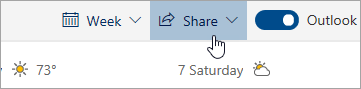

# Deljenje sa Outlookom na WebuSharing with Outlook on the web

1. Na dnu stranice izaberite "Kalendar" da biste otišli u kalendar.At the bottom of the page, select Calendar to go to Calendar.

2. U fascikli "Kalendar", na traci sa alatkama na vrhu stranice izaberite stavku **Deljenje**i odaberite kalendar koji želite da delite.In Calendar, on the toolbar at the top of the page, select **Share**, and choose the calendar you want to share. 

    

    **Napomena**: kalendare u vlasništvu drugih osoba ne možete da delite.**Note**: You can't share calendars owned by other people.

3. Unesite ime ili e-adresu osobe sa kojom želite da delite kalendar.Enter the name or email address of the person you want to share your calendar with.

4. Odaberite način na koji želite da osoba koristi vaš kalendar:Choose how you want the person to use your calendar: 
    - **Može da vidi kada sam zauzet**   omogućava im da vide kada ste zauzeti, ali ne obuhvata detalje kao što je lokacija događaja.**Can view when I'm busy** lets them see when you're busy but doesn't include details like the event location. 
    - **Može da pregleda naslove i lokacije**   omogućava im da vide kada ste zauzeti, kao i naslov i lokaciju događaja.**Can view titles and locations** lets them see when you're busy, as well as the title and location of events. 
    - **Može da vidi sve detalje**   omogućava im da vide sve detalje vaših događaja.**Can view all details** lets them see all the details of your events. 
    - **Mogu da uređuju**   omogućava da uređuju vaš kalendar.**Can edit** lets them edit your calendar. 
    - **Delegiranog**   omogućava im da uređuju vaš kalendar i da ga dele sa drugima.**Delegate** lets them edit your calendar and share it with others.

5. Izaberite stavku **deli**.Select **Share**. Ako odlučite da trenutno ne delite kalendar, izaberite opciju " **Ukloni**".If you decide not to share your calendar right now, select **Remove**. 

**Napomene**:**Notes**:  

- Kada delite svoj kalendar sa osobom koja ne koristi Outlook na vebu, na primer, osoba koja koristi gmail poruku, moći će da prihvati samo poziv koristeći Microsoft 365 ili nalog Outlook.com.When sharing your calendar with someone who's not using Outlook on the web, for example, someone using Gmail, they'll only be able to accept the invitation using a Microsoft 365 or an Outlook.com account. 

- ICS kalendari su samo za čitanje, tako da čak i ako dozvolite uređivanje pristupa drugim osobama, neće moći da uređuju vaš kalendar.ICS calendars are read-only, so even if you grant edit access to other people, they won't be able to edit your calendar. 

- Učestalost sinhronizuju ICS kalendara zavisi od dobavljača e-pošte osobe sa kojom ste je delili.How often your ICS calendar syncs depends on the email provider of the person you've shared it with. 

- Stavke kalendara označene kao privatne su zaštićene.Calendar items marked private are protected. Većina osoba koje delite kalendar možete da vidite samo vreme koje su označene kao privatne, a ne naslov, lokacija ili drugi detalji.Most people you share your calendar with see only the time of items marked private, not the title, location, or other details. Periodična grupa označena kao privatna će takođe prikazati obrazac ponavljanja.Recurring series marked as private will also show the recurrence pattern.
