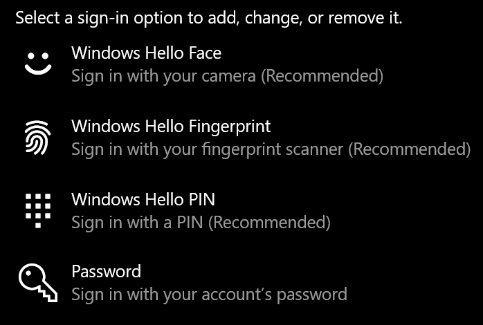
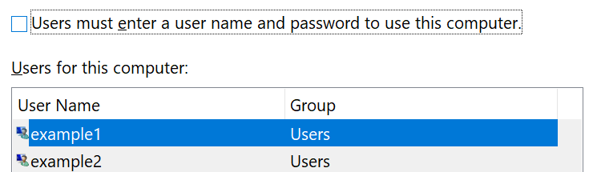

# Prijavljivanje u operativni sistem Windows 10 bez korišćenja lozinke

Da biste izbegli da otkucate lozinku pri pokretanju operativnog sistema Windows, preporučujemo vam da koristite neku od opcija za Windows Hello bezbedna prijavljivanja, kao što je PIN, prepoznavanje lica ili otisak prsta, ako je dostupan. Ako zaista želite da onemogućite bezbednu prijavljivanje, pogledajte dolenavedena uputstva "automatski se prijavi u Windows 10".

**Bezbedni Windows Hello alternative za lozinku naloga**

Izaberite **podešavanja > nalozi > opcije za prijavljivanje** (ili kliknite [ovde](ms-settings:signinoptions?activationSource=GetHelp)). Biće navedene raspoložive opcije za prijavljivanje. Na primer:

Kliknite ili dodirnite jednu od opcija da biste je konfigurisali. Sledeći put kada pokrenete ili otključate Windows, moći ćete da koristite novu opciju umesto lozinke. 

**Automatsko prijavljivanje na Windows 10**

**Napomena**: automatsko prijavljivanje je zgodno, ali predstavlja bezbednosni rizik, naročito ako je računaru dostupno više osoba. 

1. Kliknite ili dodirnite dugme " **Start** " na traci zadataka.

2. Ukucajte **netplwiz** i udarajte tipku ENTER da biste otvorili prozor korisnički računi.

3. U **korisničkim nalozima**izaberite nalog na koji želite da se automatski prijavite kada se Windows pokrene.

4. Opozovite izbor u polju za potvrdu "korisnici moraju da unesu korisničko ime i lozinku da bi koristili ovaj računar".

    

5. Kliknite na dugme **U redu**. Od vas će se zatražiti da unesete i potvrdite lozinku za nalog koji ste izabrali. Kliknite na dugme **u redu** da biste završili. Sledeći put kada se pokrene Windows 10, on će se automatski prijaviti u nalog koji ste izabrali.
