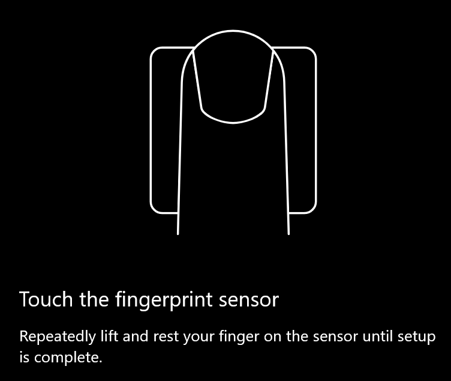
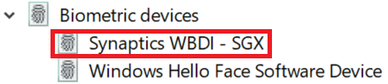

# Korišćenje opcije za otključavanje otiska prsta u operativnom sistemu Windows 10Use fingerprint unlock option in Windows 10

**Omogući Windows Hello otisak prsta****Enable Windows Hello Fingerprint**

Da biste otključali Windows 10 pomoću otiska prsta, potrebno je da podesite Windows Hello otisak prsta tako što ćete dodati (Ako Windows nauči da prepozna) bar jedan prst.To unlock Windows 10 using your fingerprint, you need to set up Windows Hello Fingerprint by adding (letting Windows learn to recognize) at least one finger. 

1. Izaberite **podešavanja > nalozi > opcije za prijavljivanje** (ili kliknite [ovde](ms-settings:signinoptions?activationSource=GetHelp)).Go to **Settings  > Accounts > Sign-in options** (or click [here](ms-settings:signinoptions?activationSource=GetHelp)). Biće navedene raspoložive opcije za prijavljivanje.Available sign-in options will be listed. Na primer:For example:

    

2. Kliknite ili dodirnite **Windows Hello otisak prsta**, a zatim kliknite na dugme **Podesi**.Click or tap **Windows Hello Fingerprint**, then click **Set up**. U prozoru "Windows Hello podešavanje" kliknite na dugme " **Započni**".In the Windows Hello setup window, click **Get started**. Senzor otisaka prstiju će se aktivirati i od vas će se zatražiti da postavite prst na senzor:The fingerprint sensor will activate, and you'll be asked to place your finger on the sensor:

   

3. Sledite uputstva koja će vam zatražiti da više puta skenirate prst.Follow the instructions, which will ask you to repeatedly scan your finger. Kada se ovo završi, imaćete mogućnost dodavanja ostalih prstiju koje ćete možda želeti da koristite za prijavljivanje.When this is finished, you'll have the option of adding other fingers you may want to use for sign-in. Sledeći put kada se prijavite u Windows 10, imaćete opciju da koristite otisak prsta da biste to uradili.Next time you sign in to Windows 10, you will have the option of using your fingerprint to do so.

**Windows Hello otisak prsta nije dostupan kao opcija za prijavljivanje****Windows Hello Fingerprint not available as a sign-in option**

Ako Windows Hello otisak prsta nije prikazan kao opcija u **opcijama za prijavljivanje**, to znači da Windows nije upoznat sa bilo kojim čitačem otisaka prstiju/skenera koji je PRIKLJUČEN na računar ili da smernice sistema sprečavaju njeno korišćenje (ako na primer, računar upravlja vašim radnim mestom).If Windows Hello Fingerprint is not shown as an option in **Sign-in options**, it means Windows is not aware of any fingerprint reader/scanner attached to your PC, or that a system policy prevents its use (if for example your PC is managed by your workplace). Da biste rešili problem:To troubleshoot: 

1. Kliknite na dugme **Start** na traci zadataka i potražite **Upravljač uređajima**.Select the **Start** button in the Taskbar and search for **Device Manager**.

2. Kliknite ili dodirnite da biste otvorili **Upravljač uređajima**.Click or tap to open **Device Manager**.

3. U upravljaču uređajima razvijte biometrijske uređaje tako što ćete kliknuti na njegov ševron.In Device Manager, expand Biometric devices by clicking its chevron.

   

4. Skener otisaka prstiju bi trebalo da bude naveden kao biometrijski uređaj, kao što je Synaptics WBDI skener:Your fingerprint scanner should be listed as a biometric device, such as the Synaptics WBDI scanner:

   

5. Ako skener otisaka prstiju nije prikazan, a skener je integrisan u računar, posetite Veb lokaciju proizvođača računara.If your fingerprint scanner is not shown, and the scanner is integrated into your PC, go to the PC manufacturer's website. U odeljku za tehničku podršku za model računara potražite Windows 10 upravljački program za skener koji možete da instalirate.In the technical support section for your PC model, search for a Windows 10 driver for a scanner that you can install.

6. Ako je skener odvojen od računara (priključen preko USB-a), posetite Veb lokaciju proizvođača skenera da biste pronašli i instalirali softver upravljačkog programa za Windows 10 za model skenera koji imate.If the scanner is separate from the PC (attached via USB), go to the scanner manufacturer's website to find and install Windows 10 device driver software for the scanner model you have.
