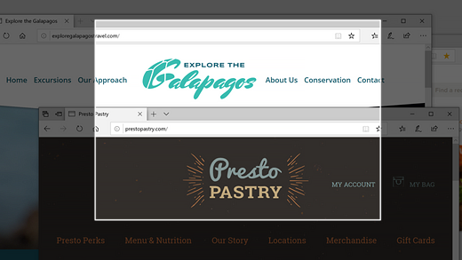
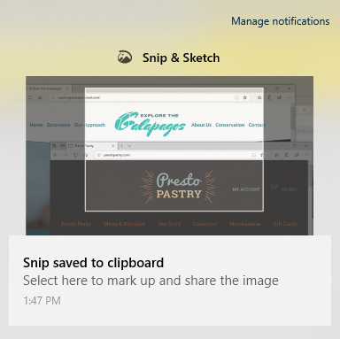

# Korišćenje isečka & skice za hvatanje, označavanje i deljenje slika

Crtež se sada naziva **odsečak & skicom**. **Da biste brzo uzimali odsečak**:

1. Pritisnite taster sa **Windows logotipom + SHIFT + S**. Videćete ekran na vašem ekranu, a kursor će biti prikazan kao krst. 

2. Odaberite tačku na ivici oblasti koju želite da kopirate i kliknite dvaput na kursor. 

3. Pomerite kursor da biste istakli oblast koju želite da uhvatite. Oblast koju uhvatite će se pojaviti na ekranu.

   

Slika koju ste predobili je sačuvana u ostavi, spremna za lepljenje u e-poruku ili dokument. 

**Ako želite da uredite ili prikažete sliku**: 

- Kliknite na ikonu "obaveštenja" koja se nalazi na krajnjoj desnoj strani trake zadataka. zatim kliknite na sliku koju ste upravo snimili. Odsečak se otvara u aplikaciji isečak & crtež.

   
