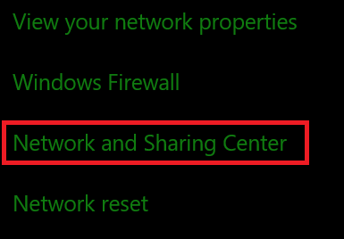
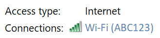
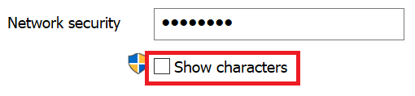

# Prikaži lozinku za Wi-Fi mrežu u operativnom sistemu Windows 10View Wi-Fi network password in Windows 10

1. Uverite se da je računar sa operativnim sistemom Windows 10 povezan sa Wi-Fi mrežom.Make sure your Windows 10 PC is connected to the Wi-Fi network.

2. Idite na **podešavanja > mrežom & Internet >** ili kliknite ili dodirnite [ovde](ms-settings:network?activationSource=GetHelp) da biste nas odmah odvesti.)Go to **Settings  > Network & Internet  > Status**, or click or tap [here](ms-settings:network?activationSource=GetHelp) to let us take you there now.)

3. Izaberite stavku **Centar za mrežu i deljenje**.Click **Network and Sharing Center**.

    

4. U **centru za mrežu i deljenje**, pored **veza**, videćete ime bežične mreže.In **Network and Sharing Center**, next to **Connections**, you will see the name of your wireless network. Na primer, ako je vaša mreža nazvana "ABC123", možda ćete videti:For example, if your network is named "ABC123," you might see:

    

    Kliknite na ime bežične mreže da biste otvorili prozor "Wi-Fi status".Click the wireless network name to open the Wi-Fi Status window. 

5. U prozoru za Wi-Fi status izaberite stavku **Svojstva bežične mreže**, izaberite karticu **bezbednost** i proverite **znakove za prikaz**.In the Wi-Fi Status window, click **Wireless Properties**, click the **Security** tab, and check **Show characters**.

    

